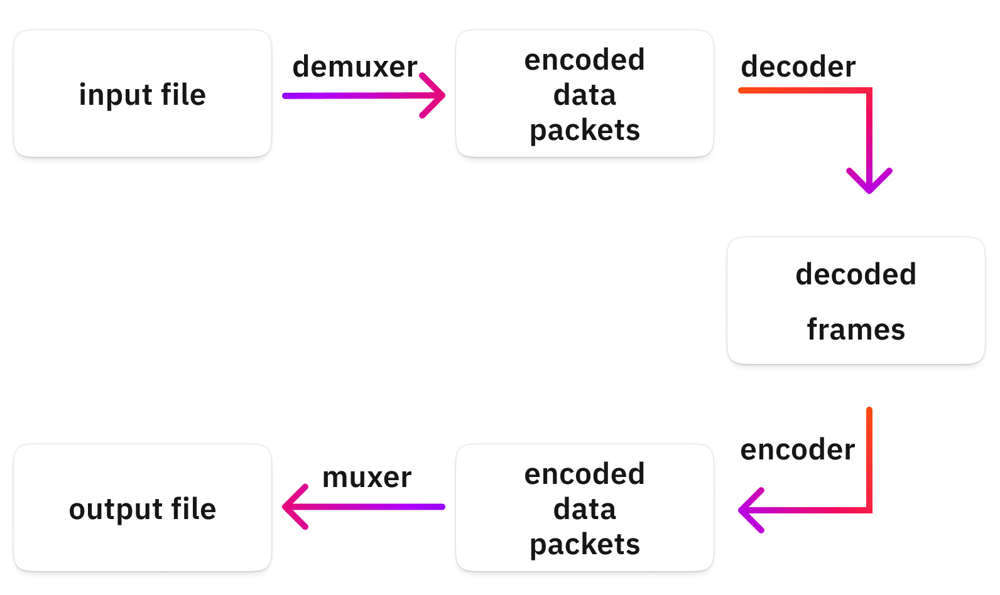

# Editing App

A Flutter and FFmpeg project.

## About FFmpeg
FFmpeg is the leading multimedia framework, able to decode, encode, transcode, mux, demux, stream, filter and play pretty much anything that humans and machines have created.

# Media Concepts
1. Image
- Resolution: 
    - An image consists of pixels, single points that have a single color. The resolution of an image determines how many columns and rows of pixels are in an image.
    - Ballpark values:
        - "HD" or "Full HD" or "1K" or "1080p" means 1920x1080 pixels.
        - "4K" could mean a few values, but it should be about 3840x2160 pixels.
        - A regular 16mp photo you make of your cat is about 4608x3456 pixels.
        - General social media image posts are about 1080x1080 pixels.

- Bit-depth:
    - Bit-depth represents the number of bits used for storing a single pixel's color value.
    - Ballpark values:

        | BITS   | COLORS   | Notes |
        |------------|------------|------------|
        | 1 | 2 | Black & White |
        | 8 | 256 | B/W or Limited color palette |
        | 24 | 16.7m | 3x8 bit for R-G-B "True color" |
        | 30 | 1073m | 3x10 bit for R-G-B "Deep color" |

- Transparency: 
    - Some image formats support an additional channel together with the red, green, and blue components: the alpha channel. The alpha channel determines how transparent a single pixel is, and it can have different bit-depths, it is usually either 1, 8 or 16 bits.
    - If the alpha channel is 1 bit, then the format can encode a pixel to be either transparent or non-transparent. If it is 8 or more bits, then the format can encode 256 or more steps of transparency.

2. Video 
- Framerate: 
    - Defines how many images are shown in a second.
    - Common values for this are 24, 25, 30, or 60.
    - A video file also has a **codec** assigned to it, which is the format describing how all those images were compressed into this video file.

- Codecs:
    - Compression is a super important thing when it comes to video because you have thousands of images to keep together.
    - Common codecs:
        - H.264, H.265: These are the most common ones, with the widest support in browsers, phones, players, ... It focuses on small file sizes with good quality.
        - Apple ProRes, DNxHD: These are common formats for production. They focus on quality and ease of processing and not on file size.
    - Features:
        - Storing only the differences between frames.
        - Removing details that humans won't notice.
        - Using clever algorithms to predict motion and group redundant data.

3. Audio
- Sampling rate:
    - The sampling rate is the factor that shows how many times we measure/scan/sample the input data stream.
    - Measure less, lose more details, size smaller, and vice versa.
    - Ballpark values:
        - 8 kHz (GSM - Low quality)
        - 44.1 kHz (CD - High quality)
        - 48 kHz (Very high quality)
        - 88.2 kHz (Insane - usually for - production only)
        - 96 kHz (Insane - usually for production only)

- Bitrate:
    - Bitrate represents the amount of data per second that results from our transcoding/quantization process.
    - Ballpark values:
        - 13 kbits/s (GSM quality)
        - 256 kbits/s (Common high-quality)
        - 320 kbit/s (High-quality MP3)
        - 1411 kbit/s (16bit WAV, CD quality, PCM)

- Channels:
    - Inside of most audio formats, you can have more audio channels. This means multiple, separated audio streams can be in the same file.
    - channels are just separate "recordings" or "streams" of audio signals.

- Codecs:
    - The goal of audio codecs is the same as what we saw with the video codecs.
    - Commons codecs:
        - MP3, AAC, OGG: These are common lossy audio formats.
        - PCM, FLAC: These are lossless formats.
        - MIDI: It is like a music sheet that might sound different on different players or settings.

4. Containers
- A container is a format specification, that combines all these streams into a single file format. It defines how to put all these data together, how to attach metadata (author, description, ...), how to synchronize these streams, and sometimes a container even contains indexes to aid seeking.
- Common containers:
    - MOV
    - MP4
    - MKV
    - WebM
    - WAV (audio only)

## FFmpeg Concepts
1. Intro to how FFmpeg works

    

- Demuxer:  Extracts or separates individual streams (audio, video, subtitles, etc.) from a container format.
- Decoder: Converts compressed data back into a raw format for playback or editing.
- Encoder: Converts raw data (uncompressed video frames or audio samples) into a compressed format using a specific codec.
- Muxer: Combines multiple streams (audio, video, subtitles, ...) into a single file or stream.

2. Inputs
-  The input could come from many sources, such as the network, a hardware device, ...
- FFmpeg can open any number of input files simultaneously, and the filtering and mapping will decide what it will do with those.

3. Streams
- Streams are the fundamental building blocks of containers.
- Every input file must have at least one stream.

4. Outputs
- An output could be a local file, a socket, a stream, ...
- You could have multiple outputs, and the mapping determines what goes into which output file.
- The output also must have some format or container.

5. Mapping
- Mapping refers to the act of connecting input file streams with output file streams.

6. Filtering
- Filtering stands for the feature of FFmpeg to modify the decoded frames (audio or video).

## Basic options
1. Global options:
- **-y**: overwrite the output
- **filter_complex**: modify frames
    - Basic syntax
    ``` 
    FILTER_NAME=ARGUMENT1=VALUE1:ARGUMENT2=VALUE2 
    ```
    - Multiple filters in a chain: separate them with a ,
    - Multiple chains: separate them with a ;

2. Input options:
- **-i**: The input file

3. Output options:
- **-c:v**: version of codec:c
    - c:v libx264
        - -pix_fmt *n*:
            - specifies the pixel format of the output video
            - widely compatible with most players, platforms, and devices. 
            - other pixel formats:
                - yuv422p: higher color fidelity and larger size
                - yuv444p: No chroma subsampling, highest quality but significantly larger size.
        - preset *n*:
            - libx264 has a lot of variables that you can be tune, and most of them balance the coding speed and the resulting file size.
            - To make your life easier, there are [presets](https://trac.ffmpeg.org/wiki/Encode/H.264?ref=img.ly#Preset) by which you can easily declare what you need: small size or speed.
        - -crf *n*: 
            - Constant rate factor, the main option for setting image quality.
            - It is a number between 0-51, where 0 is lossless, and 51 is the worst quality. Generally, you want something between 17 and 28. This is the option to tune the balance between image quality and file size.
- **-b:a**: bitrate of audio
    - -b:a 256k
- **-f**: format
    - -f mp3
- **-ar**: sample rate
    - -ar 48000
- **-ac**: channel
    - -ac 1: for mono
    - -ac 2: for stereo
- **-c:v**: video codec
- **-c:a**: audio codec
    - **copy**: copy video/ audio codec
    - **-an**: no audio
    - **-vn**: no video

- **scale**: 


## Commands
1. Command line order
    ```
    ffmpeg [global_options] {[input_file_options] -i input_url} ... {[output_file_options] output_url} ...
    ```
- global options > inputs > outputs
- i/o options come BEFORE the i/o specification.

2. Trim
    - Use the "-ss" flag. The value can be specified in s/ms or as a timestamp
    - Options:
        - -t: This sets the duration
        - -to: this sets the timestamp where the input video should stop


## References
1. [FFmpeg](https://ffmpeg.org/about.html)
2. [FFmpeg - The Ultimate Guide by Csaba Kopias](https://img.ly/blog/ultimate-guide-to-ffmpeg/#editing-video)
